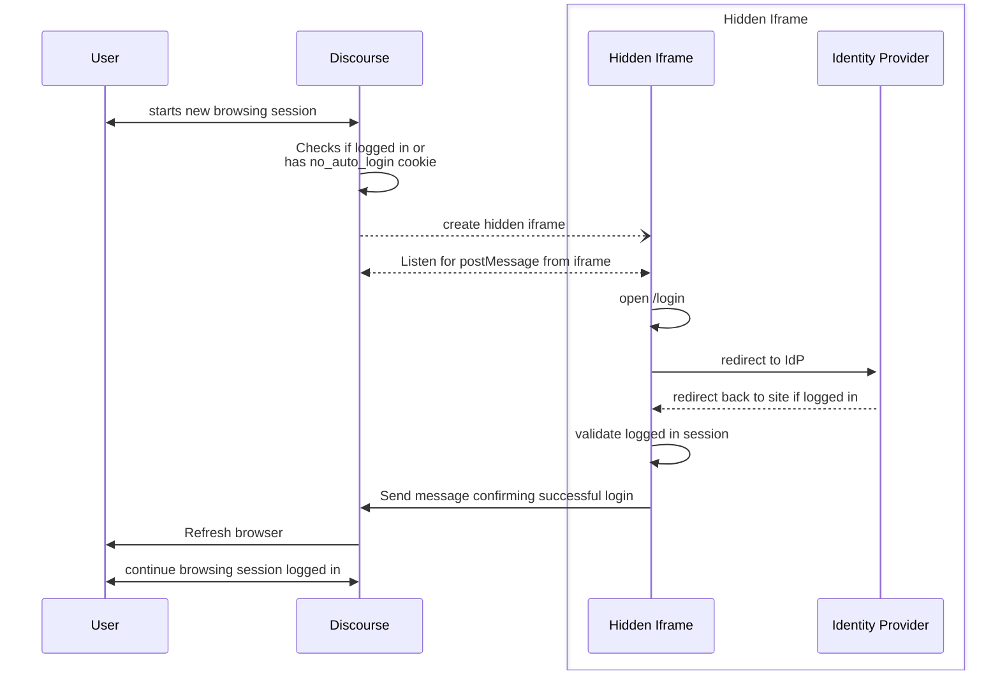
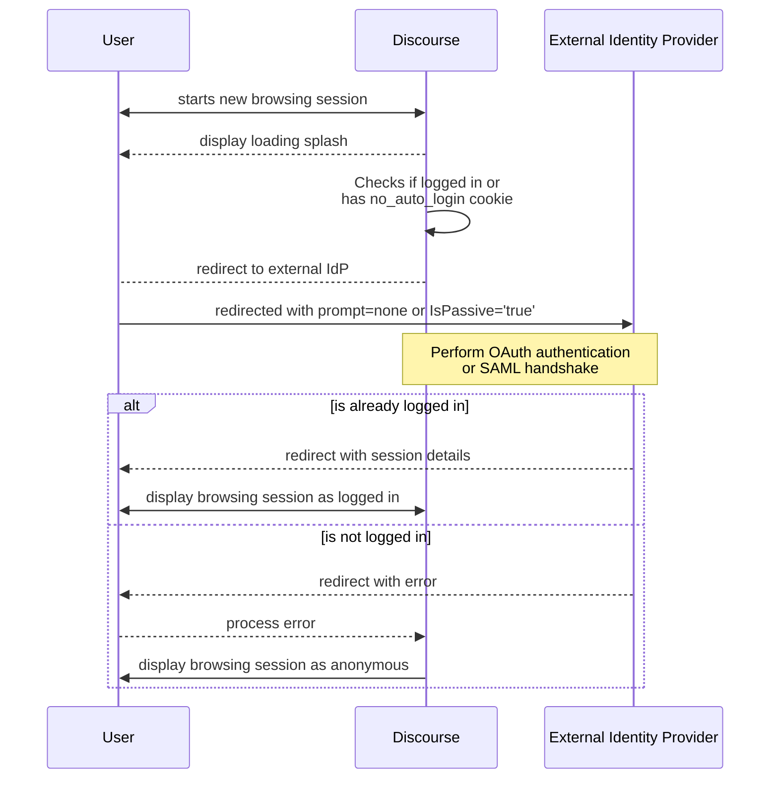

# Discourse Auto Login

This plugin allows for automatic logins for Discourse users without user interaction. If the user is already logged in to an external provider and has an account associated with Discourse, this plugin will attempt to automatically log in the user when they visit the site.

> [!NOTE]
> This only works when the Discourse forum only has one method of logging in, via a single external provider. This does not support local username/password logins.

This plugin is designed to support OAuth 2.0 OIDC and SAML2.0 specs. However this relies heavily on the external identity provider (IdP) to fully support certain features depending on which `auto_login_strategy` is used. See more info below for configuration needs and caveats.

## Settings
* `auto_login_enabled`: Enables the plugin
* `auto_login_strategy`: Determines how the plugin will attempt the auto login. Options are `redirect` and `iframe`. For more info, please see below. Default: `redirect`
* `auto_login_days_cooldown_after_logout`: Determines how long the plugin should wait to auto login a user after they are logged out in a browser. Default: `30` days. Min: `1`. Max: `365`.

## Auto Login Strategies and Design

This plugin employs two optional strategies for performing the auto login without user interaction (otherwise known as silent authentication). This is a silent redirect based authentication and a hidden iframe based authentication. It is **strongly** advised to use the `iframe` approach **only** if the site owner has complete control over the IdP, such that the IdP shares the same root domain as the forum, and can change Content Security Policies and headers to allow iframing.

If the site utilizes an external IdP that cannot be configured as such, `redirect` is the only approach available.

### Iframe based Authentication

This strategy allows users to remain entirely within the site without being redirected (save for a single refresh). This works best if you are hosting or have complete control over the relying IdP.

> [!WARNING]
> The IdP must be on the same root domain as the site, and have configurable headers and Content Security Policies (CSP).
>
> Modern browsers currently employ multiple safegaurds around Cross-Origin Resource Sharing (CORS), designed to protect and improve user privacy. This includes blocking 3rd party cookies from being passed in and out of iframes. If the relying IdP is not within the same root domain as the site, most browsers will prevent the iframe from knowing if the user is logged in or not. Similarly, if the relying IdP has a restrictive CSP or headers, such as `frame-ancestor` and `X-Frame-Options: DENY`, the iframe will not be able to load the IdP.

When the user starts a new session, if they are not logged in, the plugin will create a hidden iframe connected to the IdP. If the user is already logged in the IdP, the iframe will be redirected back to the site with the appropriate session details to authenticate the user. As Discouse employs a cookie based authentication, the session details are automatically promoted up to the top level. Once the top level document receives an indication that the user has successfully logged in, the page will automatically refresh into the new session.

Flow Diagram

### Silent Redirect based Authentication

This strategy involves redirecting the user to the external IdP with a log in page, and redirecting back. If the user is already logged in, the IdP will redirect the user back with the session details needed to automatically log the user in. If the user is not logged in, the external IdP will automatically redirect the user back, and will remain in an anonymous browsing session. This method avoids the common CORS issues related to the iframe based approach, allowing external IdPs to communicate with Discourse without exposing user privacy.

> [!NOTE]
> This is the recommended (and often the only) method of silent authentication used on the web with external IdPs (Google, Auth0, etc.). However, it relies heavily on IdPs being spec compliant.

This plugin utilizes the parameters `prompt=none` and `IsPassive='true'` for OAuth 2.0 OIDC and SAML2.0 based authentication respectively. From testing, the majority of IdPs that support OAuth2.0 will support `prompt=none`, preventing the user from being stuck on the login page during the redirect. However, support for SAML2.0 `IsPassive` is optional, so it may not be supported.

Flow Diagram

## Logout and Anonymous Browsing Sessions

To allow anonymous browsing and prevent looping on log out, the plugin utilizes a cookie named `no_auto_login`. The plugin uses the presence of this cookie to determine whether to continue the auto login flow. If a user was previously logged in and is logged out, the `no_auto_login` cookie will be set with an expiry determined by `auto_login_days_cooldown_after_logout`. This cookie expires by default in 30 days, during which no attempt to auto login the user is made. If the user manually logins, the cookie is always cleared from the browser.

This cookie is also set if an auto login fails, where the cookie will instead last for the remainder of the session. This means that everytime the user opens the site in a fresh browsing session, the plugin will attempt to auto login. This should safely allow the user to browsing in the current session (including openning new tabs) without triggering the auto login flow.

## Development

The initial steps of the auto login are performed by the JS code, while the parameter injections in the redirect flow are performed by Rails. Redirects are performed by JS as well, to minimize risk to impacting web crawlers and SEO.

The plugin follows specs for handling `prompt=none` and `IsPassive` related errors in the omniauth `on_failure` hook, but external IdPs may employ custom errors (such as Google using `immediate_failed`). Modifications in `plugin.rb` may be required.

Authentication in general currently relies heavily on the usage of cookies, which may be blocked in certain browser instances such as Google Chrome Incognito mode. Take care when testing.
